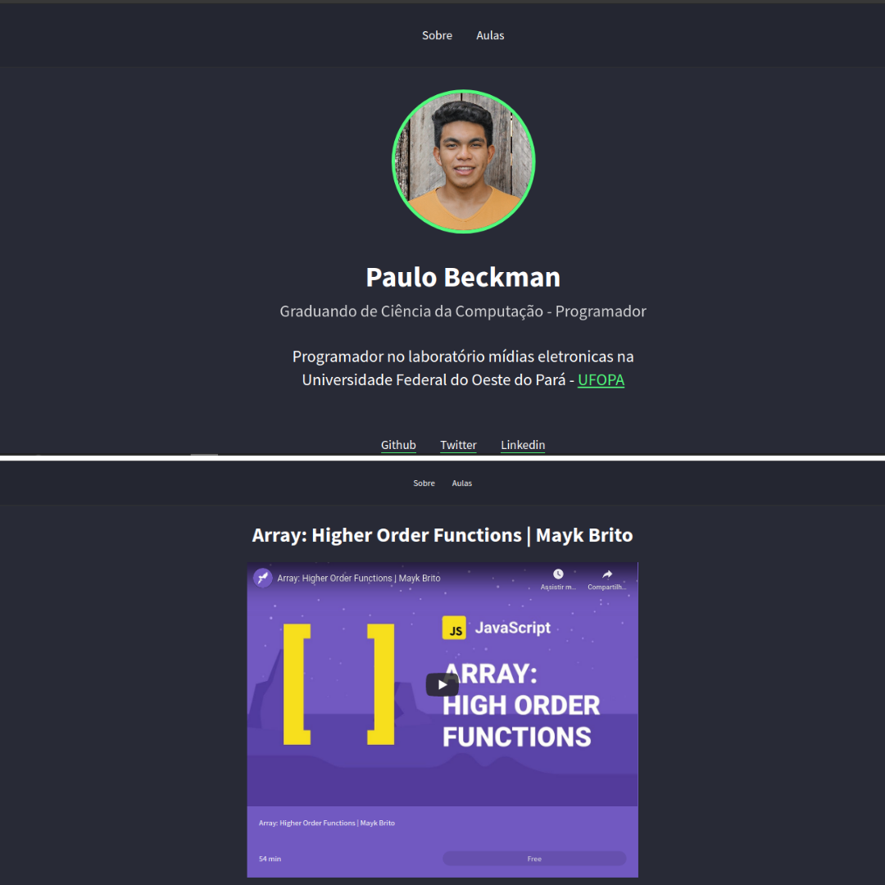
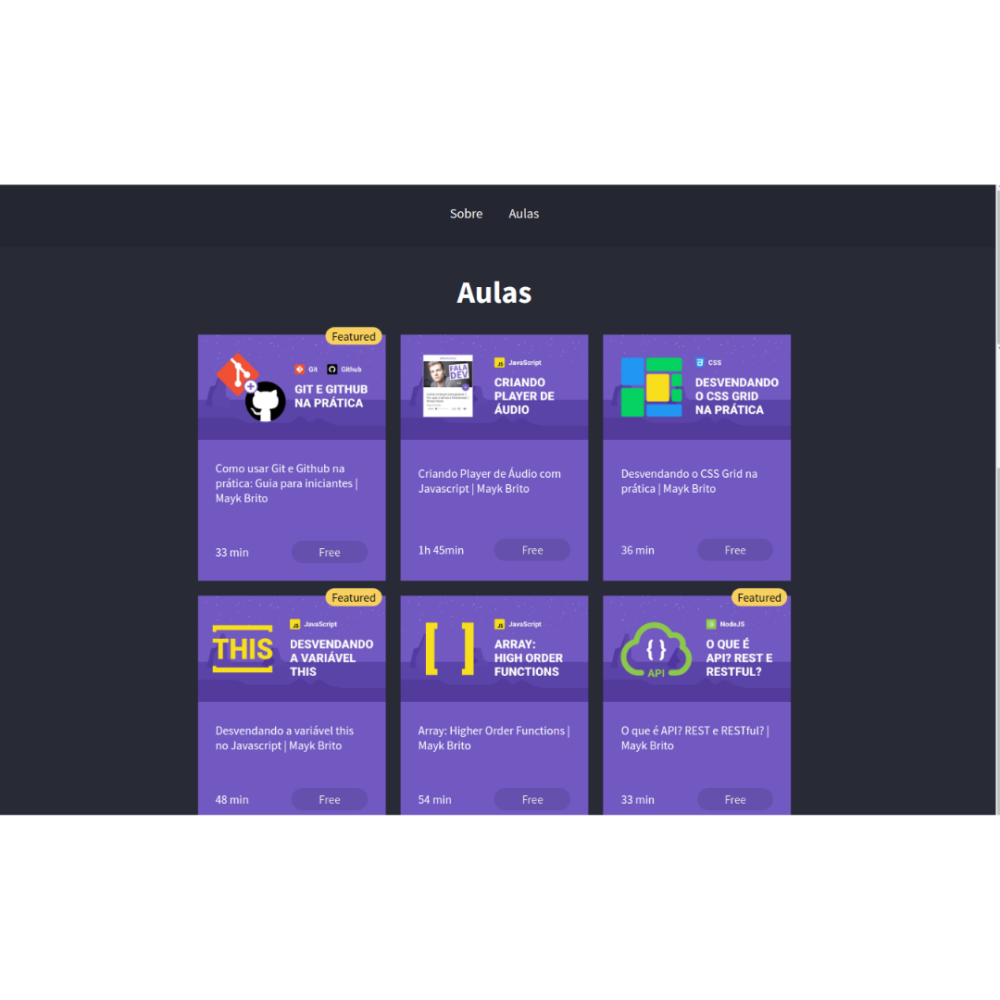

<h1 align="center">
    Web Information And Videos Version 2
</h1>

<h4 align="center"> 
	🚀 Web Information And Videos v2 🚀
</h4>

<p align="center">
  

  

  	
  <a href="https://www.linkedin.com/in/paulobeckman/">
    
  </a>
	
  
  <a href="https://github.com/paulobeckman/rocketseat-courses/commits/master">
    
  </a>

  
   <a href="https://github.com/paulobeckman/web-information-and-videos-v2/stargazers">
    
  </a>
</p>


## 💻 Sobre o projeto

 ▶ Web information and videos version 2 apresenta as informações sobre um aluno, além de poder redirecionar para todas as redes sociais dele.
Esse projeto apresenta mudanças em relação ao projeto anterior [web information and videos](v1):
- na aba aulas, nela não é aberta uma janela, agora o usuário, ao clicar em um card, ele é direcionado para uma pagina com uma url escífica e nela contém o vídeo referente ao card escolhido;

O usuário poderá ser redirecionado para:
- acessar o GitHub, LinkedIn e Instagram do aluno.

Na aba aulas o aluno tem acesso a seis cards referentes a vídeos do youtube da [Rocketseat](rs):
- cada card tem uma thumbnail, título, tempo de duração e se o curso e pago ou gratuito;
- ao clicar em cada card, o usuário irá para uma página dedicada para aquele vídeo escolhido, com url específica. Nessa página o usuário pode assitir o vídeo.


Projeto desenvolvido no curso **LaunchBase** oferecida pela [Rocketseat](rs).
"O [LaunchBase](lb) é um treinamento no formato de bootcamp online que tem duração de 8 semanas. A cada semana os conteúdos são liberados de acordo com um cronograma, guiando o aluno pelas ferramentas e conceitos mais modernos de desenvolvimento que permitirão construir as melhores aplicações e ter acesso às melhores oportunidades como programador." - Rocketseat


### Web

<p align="center" style="display: flex; align-items: flex-start; justify-content: center;">
	
 

  

  
</p>

## 🛠 Tecnologias

As seguintes ferramentas foram usadas na construção do projeto:

- [Node.js][nodejs]
- [Java Script][js]
- [CSS][CSS]
- [HTML][HTML]


## 🚀 Como rodar este projeto
 
Podemos considerar este projeto como sendo divido em duas partes:
1. Back End (arquivos server.js, data.js e pasta public) 
2. Front End (pasta views)

💡O Front End presisa que o Back End esteja sendo executado para funcionar.

### Pré-requisitos

Antes de começar, você vai precisar ter instalado em sua máquina as seguintes ferramentas:
[Git](https://git-scm.com), [Node.js][nodejs]. 
Além disto é bom ter um editor para trabalhar com o código como [VSCode][vscode]

### 🧭 Rodando a aplicação web (Front End)

```bash
# Clone este repositório
$ git clone https://github.com/paulobeckman/web-information-and-videos-v2.git

# Acesse a pasta do projeto no terminal/cmd
$ cd web-information-and-videos-v2

# Instale as dependências
$ npm install

# Execute a aplicação em modo de desenvolvimento
$ npm start

# O servidor inciará na porta:5000 - acesse http://localhost:5000
```


## 📝 Licença

Este projeto esta sobe a licença MIT. Veja a [LICENÇA](license) para saber mais.

Feito por Paulo Beckman 👋🏽 [Entre em contato!](https://www.linkedin.com/in/paulobeckman/)

[nodejs]: https://nodejs.org/
[vscode]: https://code.visualstudio.com/
[vceditconfig]: https://marketplace.visualstudio.com/items?itemName=EditorConfig.EditorConfig
[license]: https://opensource.org/licenses/MIT
[rs]: https://rocketseat.com.br
[lb]: https://pages.rocketseat.com.br/launchbase/inscricao/5
[js]: https://developer.mozilla.org/pt-BR/docs/Aprender/JavaScript
[CSS]: https://developer.mozilla.org/pt-BR/docs/Web/CSS
[HTML]: https://developer.mozilla.org/pt-BR/docs/Web/HTML
[v1]: https://github.com/paulobeckman/web-information-and-videos
